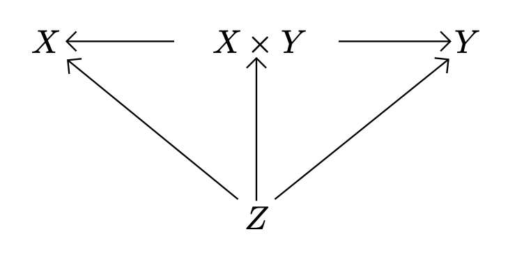
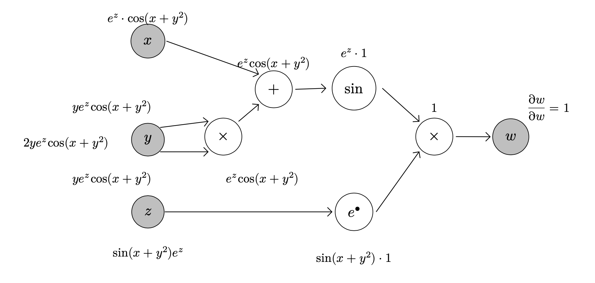

# TikZyFi - Incomplete SATySFi realisation of miniature TikZ

## Motivation

A mostly incomplete, unSATySFiing realisation of a really small subset of TikZ in [SATySFi](https://github.com/gfngfn/SATySFi).

We want to port the following TikZ features in SATySFi:

- [x] Layout nodes using matrix
- [x] Place nodes using relative position to other nodes.
- [ ] Drawing paths between existing node
  + [x] Arrow
  + [ ] Bent Arrow
  + [ ] Solid Line
- [ ] Simple node shape specification
  + [x] Circle
  + [ ] Oval
  + [ ] Rectangle
- [ ] Easy labeling around nodes and arrows.
- [ ] Basic arithmetic on coordinates (projection, crosspoints, ...)

## Example(s)

```satysfi
\tikzy?:(|default with unit-length = 2cm|)[
  matrix?:(`mat`)
  [ [ node?:[named `X`] {${X}}
    ; node?:[named `XxY`]{${X \times Y}}
    ; node?:[named `Y`] {${Y}}
    ]
  ; [ empty; node?:[named `Z`]{${Z}}]
  ]
; arrow (west-of `XxY`) (east-of `X`)
; arrow (east-of `XxY`) (west-of `Y`)
; arrow (north-west-of `Z`) (south-east-of `X`)
; arrow (north-east-of `Z`) (south-west-of `Y`)
; arrow (north-of `Z`) (south-of `XxY`)
];
```

Yields:



This can also be written as:

```satysfi
\tikzy?:(|default with unit-length = 1.5cm|) 
  [ matrix?:(`mat`)
    [[ node {${X}}; node {${X \times Y}}; node {${Y}} ]] 
  ; node-at ?:[named `Z`] (south-of `mat-0-1`) {${Z}}
  ; arrow (west-of `mat-0-1`) (east-of `mat-0-0`)
  ; arrow (east-of `mat-0-1`) (west-of `mat-0-2`)
  ; arrow (north-west-of `Z`) (south-east-of `mat-0-0`)
  ; arrow (north-east-of `Z`) (south-west-of `mat-0-2`)
  ; arrow (north-of `Z`) (south-of `mat-0-1`)
  ];
```

More complex example:



See [`example.saty`](./example.saty) (and [`example.pdf`](./example.pdf)) for details.

## TODOs

- [ ] Restructure library
- [ ] Stop using `inline-frame-outer`
- [ ] More fine-grained configuration
  + [ ] `colsep`, `rowsep`, ...
- [ ] Flexible Arrow/Line styling
- [ ] Appropriate padding and margin treatment
- [ ] Correct distinction/handling of anchors and centers
- [ ] Make it a SATySFi package and publish it to Satyrographos
- [ ] Make the layout engine sane
- [ ] Consider using envelopes (ala `diagrams` package in Haskell)
- [ ] Use `right`, `left`, `above`, and `below` instead of `east`, `west`, `north` and `south`.
- [ ] More usable default placing heuristics with relative positioning.
